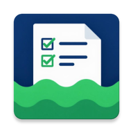

# EasyMeldelist

EasyMeldelist ist eine Android-App zur Verwaltung von Schwimmer-Meldelisten.
Sie hilft Trainern und Eltern, Teilnehmer für Wettkämpfe zu verwalten und
zeigt auf Basis der Meldezeiten eine Prognose der Medaillenchancen an.

## Funktionen

- **Meldelisten-Verwaltung**: Verwaltung von Schwimmern und Meetings,
  Anlegen neuer Teilnehmer direkt im Kontext des aktuellen Meetings
- **Medaillen-Prognose**: Berechnung der Wahrscheinlichkeiten für
  Gold, Silber und Bronze anhand der Meldezeiten der Konkurrenz
- **Kompakt-Anzeige**: Die wahrscheinlichsten Medaillen inklusive
  kurzer, motivierender Texte (z. B. „Silber mit Turbomodus“)
- **Pro-Modus**: Optionale Anzeige aller Medaillenwahrscheinlichkeiten
  (Gold, Silber, Bronze) inklusive Gesamtsumme – unabhängig von der Höhe
- **Motivationsmodus**: Bei geringen Gesamtaussichten erscheinen
  kraftvolle Kurztexte statt deprimierender Null-Prozent-Anzeigen
- **Persistente Navigation**: Wichtige Aktionen bleiben beim Scrollen
  langer Listen sichtbar (Bottom-Navigation)

## Wie funktioniert die Prognose?

Die App vergleicht die Meldezeit eines Schwimmers mit den Meldezeiten
der Konkurrenten im selben Wettkampf. Daraus wird eine Wahrscheinlichkeit
je Medaillenrang abgeleitet – mit dem Wissen, dass gemeldete Zeiten auf
Renntag oft langsamer ausfallen, geht das Modell entsprechend mit
Unsicherheiten um.

## Beitragen

Vorschläge und Fehlerberichte sind willkommen! Bitte erstelle ein
Issue im Repository.

## Lizenz

Dieses Projekt steht unter der [MIT-Lizenz](LICENSE).